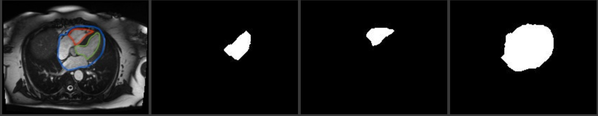

# Multi-Class Image Segmentation on a Cardio MRI Dataset

### Model (U-Net)
Image Segmentation classifies each pixel into a class. Either its part of a 
class or not labeled.

U-Net is an Encoder Decoder  neural network designed for biomedical image
segmentation. 

Unet's architecture is made up of a series of encoder layers followed by decoder layers, and skip connections between them.

Encoder is a series of: (double convolution, max_pooling) layers.

Decoder is a series of (Teanspose/up convolution, double convolution) layers.

Skip steps concatentate each encoder layer to the corresponding decoder layer 
of the same size before applying the decoder double convolution to it.
These skip connections help share localization information which is needed for 
image segmentation.

I do the following optimizations over the original UNet model:
* I do batch normalization after each convolution in double convolutions.
* I do dropout in-between double convolutions to prevent overfitting. 

My Unet model is initialized by the following Hyper-parameters:
in_channels, out_channels, conv_sizes. 
* in_channels=3 because our inputs are colored images with 3 RGB channels.
* out_channels=3 because we have 3 segmentation maps (makss) for 3 classes for 
each image. The masks are binary. So, each mask is represented in one channel.
* conv_sizes = [8, 16, 32, 64, 128] is a list of convolutions sizes used in the 
encoder and decoder levels. 


Model Input size: (batch_size, image_width, image_height, NUM_CHANNELS)
Model Output size: (batch_size, image_width, image_height, NUM_CLASSES)


## Dataset Pre-processing
To pre-process images in the dataset to generate 3 binary masks for each image.
The first mask will segment the whole heart. The second mask will segment the 
left ventricle and the third mask will segment the right ventricle.
Pre-process the dataset generating binary masks from human expert annotations.
It creates 3 new folders of binary masks:
- `images/blue` for the full heart segmentation
- `images/green` for the left ventricle segmentation
- `images/red`for the right ventricle segmentation

Each folder contains binary masks for around 800 images.
The original untraced images before generating masks are in `images/original`.

An example of the original image and masks generated is shown here:


## Usage 
To create a virtual environment:
```sh
virtualenv -p python3 torch
```
To use the virtual environment:
```sh
source ~/torch/bin/activate
pip install -r requirements.txt
```
To load the dataset in `images` directory and create `output` directory for
saving the model:
```sh
unzip UKBB-CMR-images.zip -d images
mv images/Traced/SQ/Traced\ 4\ chamber/ images/Traced/SQ/Traced/
mv images/Traced/SQ/Untraced\ Copies/ images/Traced/SQ/Originals/
mv images/Traced/PI/Original\ Untraced/ images/Traced/PI/Originals/

rm -rf output
rm -rf images/blue
rm -rf images/green
rm -rf images/red
rm -rf images/original
rm -rf */.DS_Store

mkdir images/blue
mkdir images/green
mkdir images/red
mkdir images/original

mkdir output
```
To pre-process images in the dataset to generate 3 binary masks for each image:s
```sh
python pre_process.py
```

